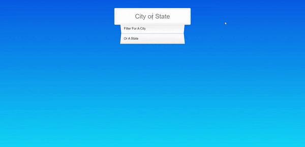

  

## Sobre
Aqui utilizamos um objeto AJAX para fazer o display de cidades e estados dos Estados Unidos, usando `fetch() e .then()` juntamente com regex, `const regex = new RegExp` e mais algumas funcionalidades.

O intuito dessa aplicação foi poder pegar esses dados e deixar de uma forma dinâmica com a procura no input deixado em tela para a aparição das funções utilizando um `.map()` para percorrer esses arrays.

## Imagem

  

## Autor

## [Gabriel Bittencourt Penteado](https://www.linkedin.com/in/gabriel-bittencourt-penteado/)

#### Feito com 🤎 por *Gabriel Bittencourt Penteado*. Entre em contato! 👋🏽