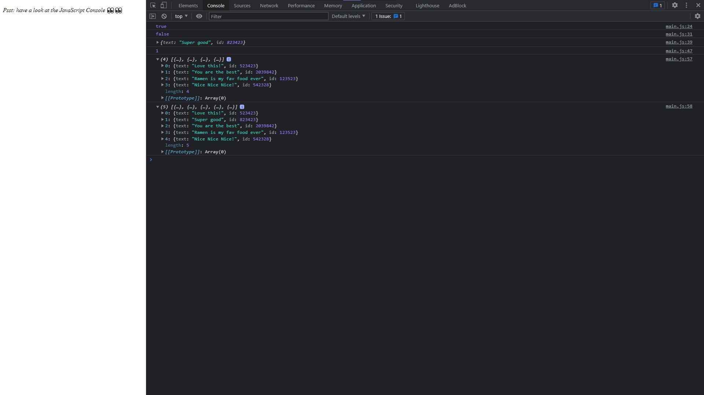

  

## Sobre
Aqui temos novamente uma prática de arrays e quais metodos temos para percorrer eles e altera-lós.

Neste exercicío utilizamos `.some()`, `.every()`, `.find()` e `.findIndex()`.

## Imagem

## Autor

## [Gabriel Bittencourt Penteado](https://www.linkedin.com/in/gabriel-bittencourt-penteado/)

#### Feito com 🤎 por *Gabriel Bittencourt Penteado*. Entre em contato! 👋🏽