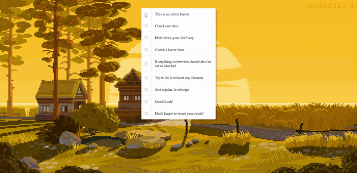

<div align="center">
  
</div>

## Sobre
No desafio de hoje utilizamos JS para fazer uma lista de checkboxes onde você pode pressionar a tecla *SHIFT* para fazer várias marcações juntas.

Utilizamos a seguinte função:
```javascript
function handleCheck(e) {
  // Checar se a tecla shift esta pressionada
  // E checar se eles estão checando os inputs
  let inBetween = false
  if (e.shiftKey && this.checked) {
    // Fazer um loop sobre todos os inputs
    checkboxes.forEach(checkbox => {
      if (checkbox === this || checkbox === lastChecked) {
        inBetween = !inBetween
      }

      if (inBetween) {
        checkbox.checked = true
      }
    })
  }

  lastChecked = this
}
```
Juntamente dela também adicionamos um `forEach()` e um `addEventListener()` para percorrer todos os inputs.

## Imagem
<div align="center">
  
</div>

## Autor


## [Gabriel Bittencourt Penteado](https://www.linkedin.com/in/gabriel-bittencourt-penteado/)

#### Feito com 🤎 por *Gabriel Bittencourt Penteado*. Entre em contato! 👋🏽