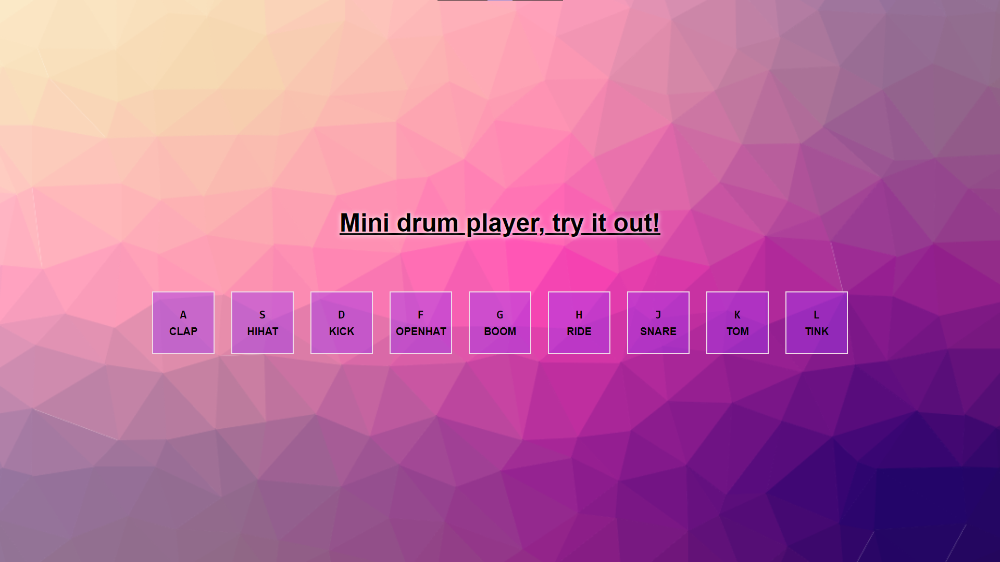

<h1 align="center">Drum Player 🥁</h1>

## Sobre
Uma pequena aplicação utilizando **JS** para transformar o seu teclado em uma bateria e reproduzir sons da mesma.

Utilizando `javascript addEventListener()` para captar o som e o momento em que as teclas são clicadas.

## Imagem

## Autor
- [GabrielBitencourt](https://www.linkedin.com/in/gabrielbittencourtpenteado/)