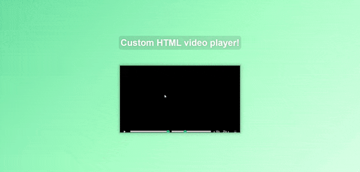

<div align="center">
  
</div>

## Sobre
No projeto de hoje construimos um player de video customizado com cores e estilos diferentes do padrão do browser para os botões e barras de progresso.

No JS utilizamos `addEventListener()` para listar todos os eventos no player e algumas funções para as funcionalidades tais como:
```javascript
// Para voltar e avançar o video, convertendo a string do dataset.skip do video para um número
function skip() {
  video.currentTime += parseFloat(this.dataset.skip)
}

// Aqui para lidar com a barra de progresso do video, pegando o tempo do video e sua duração e convertendo em porcentagem
function handleProgress() {
  const percent = (video.currentTime / video.duration) * 100
  progressBar.style.flexBasis = `${percent}%`
}
```

## Imagem
<div align="center">
  
</div>

## Autor


## [Gabriel Bittencourt Penteado](https://www.linkedin.com/in/gabriel-bittencourt-penteado/)

#### Feito com 🤎 por *Gabriel Bittencourt Penteado*. Entre em contato! 👋🏽