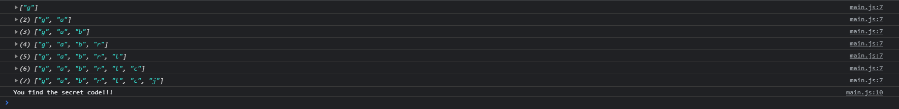

<div align="center">
  
</div>

## Sobre
No dia de hoje tivemos uma introdução sobre o Konami Code, eventos que podem ser ativados através de uma frase especifica ou com algum código, como por exemplo no BuzzFeed, tem que ser o site Americano, que se você clicar `up up down down left right left right B A enter` nas colunas ao lado aparece um efeito de confetes caindo pela página.

Para realizar isso tivemos o seguinte código:
```javascript
const pressed = [] // Aqui armazenamos as teclas clicadas
const secretCode = "gabrlcj" // Aqui é o código para ativar o evento

window.addEventListener('keyup', (e) => {
  pressed.push(e.key) // Aqui colocamos a tecla clicada dentro do array
  // Neste splice fazemos com que o tamanho do array seja igual ao tamanho do nosso código secreto assim excluindo do começo pro final as outras teclas clicadas
  pressed.splice(-secretCode.length - 1, pressed.length - secretCode.length)
  console.log(pressed)

  if (pressed.join('').includes(secretCode)) {
    console.log('You find the secret code!!!')
  }
})
```

## Imagem
<div align="center">
  
</div>

## Autor


## [Gabriel Bittencourt Penteado](https://www.linkedin.com/in/gabriel-bittencourt-penteado/)

#### Feito com 🤎 por *Gabriel Bittencourt Penteado*. Entre em contato! 👋🏽