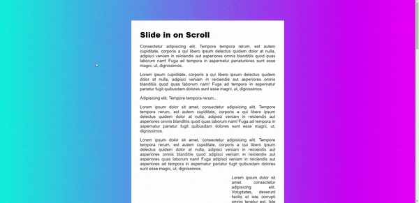

<div align="center">
  
</div>

## Sobre
Nesta aula aprendemos como fazer uma imagem aparecer conforme o evento de scroll do mouse, um evento muito interessante para as páginas. (Porém existe bibliotecas que fazem isso por nós como a [ScrollReveal](https://scrollrevealjs.org/guide/hello-world.html)).

A função principal que utilizamos foi a seguinte:
```javascript
function checkSlide() {
  sliderImages.forEach(sliderImage => {
    // Metade da imagem aparecendo
    const slideInAt = (window.scrollY + window.innerHeight) - sliderImage.height / 2
    // Parte de baixo da imagem
    const imageBottom = sliderImage.offsetTop + sliderImage.height

    const isHalfShown = slideInAt > sliderImage.offsetTop
    const isNotScrolledPast = window.scrollY < imageBottom

    if (isHalfShown && isNotScrolledPast) {
      sliderImage.classList.add('active')
    } else {
      sliderImage.classList.remove('active')
    }
  })
}
```
Servindo para adicionar uma classe nas imagens de "active" e assim tranzendo elas com o "translate".

## Imagem
<div align="center">
  
</div>

## Autor


## [Gabriel Bittencourt Penteado](https://www.linkedin.com/in/gabriel-bittencourt-penteado/)

#### Feito com 🤎 por *Gabriel Bittencourt Penteado*. Entre em contato! 👋🏽