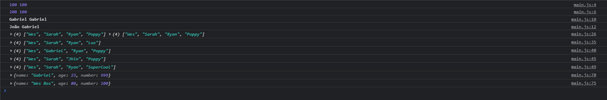

<div align="center">
  
</div>

## Sobre
Nesta aula aprendi melhor sobre copias e referencias de arrays e objetos no Javascript e como fazer alterações em copias e não em variaveis que fazem referencia aos objetos e arrays.

Com o ECMAScript temos o método que eu achei mais fácil de se utilizar que seria o `...spread` que se utiliza da seguinte forma:
```javascript
// Aqui temos um array de strings
const players = ['Wes', 'Sarah', 'Ryan', 'Poppy']

// E para ter uma cópia dele podemos utilizar o ...spread desta forma
const team3 = [...players]
team3[2] = 'Jhin'
console.log(team3)

// Assim qualquer alteração feita nessa variavel não afetara o array original
```

## Imagem
<div align="center">
  
</div>

## Autor


## [Gabriel Bittencourt Penteado](https://www.linkedin.com/in/gabriel-bittencourt-penteado/)

#### Feito com 🤎 por *Gabriel Bittencourt Penteado*. Entre em contato! 👋🏽