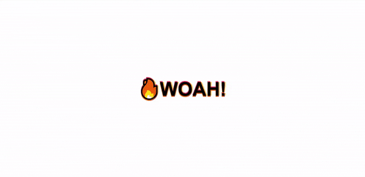

<div align="center">
  
</div>

## Sobre
Neste projeto construimos uma sombra no texto que se modifica conforme o evento de movimento do mouse, criando assim 4 sombras de cores diferentes na tela.

Para a construção desse código tivemos a seguinte função:
```javascript
// Nesta primeira parte pegamos a posição do mouse na tela
function shadow(e) {
  const { offsetWidth: width, offsetHeight: height } = hero
  let { offsetX: x, offsetY: y } = e

  // Se o elemento tem um filho ele pode alterar os valores do evento
  // Por isso usamos o this para referenciar o elemento 'hero' e não seu filho
  if (this != e.target) {
    x = x + e.target.offsetLeft
    y = y + e.target.offsetTop
  }

  // Math.round() para arredondar os números que recebemos
  // Com essa equação que traz os valores do mouse como 50 positivo ou -50 negativo
  const xWalk = Math.round((x / width * walk) - (walk / 2))
  const yWalk = Math.round((y / height * walk) - (walk / 2))

  text.style.textShadow = `
    ${xWalk}px ${yWalk}px 0 rgba(255, 118, 0, 0.8),
    ${xWalk * -1}px ${yWalk}px 0 rgba(82, 0, 106, 0.8),
    ${xWalk}px ${yWalk * -1}px 0 rgba(205, 17, 59, 0.8),
    ${yWalk}px ${xWalk}px 0 rgba(255, 169, 0, 0.8)
  `
}
```

## Imagem
<div align="center">
  
</div>

## Autor


## [Gabriel Bittencourt Penteado](https://www.linkedin.com/in/gabriel-bittencourt-penteado/)

#### Feito com 🤎 por *Gabriel Bittencourt Penteado*. Entre em contato! 👋🏽