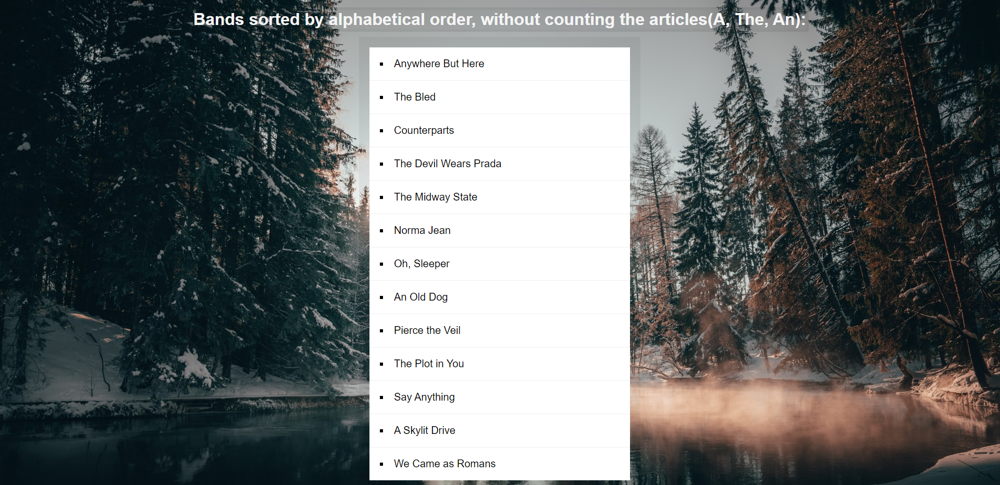

<div align="center">
  
</div>

## Sobre
Neste projeto realizamos uma listagem de bandas por ordem alfabetica e sem contar os artigos, A, The, An. Utilizando o método `sort()` do Javascript, abaixo a função utilizada para esse resultado:
```javascript
// Aqui criamos essa função com uma expressão regular para retirar os artigos indicados
// da pesquisa para listar o nome das bandas e o trim() para retirar qualquer 
// espaço em branco, isso sem alterar os dados do array.
function strip(bandName) {
  return bandName.replace(/^(a |the |an )/i, '').trim()
}

// Nesta função temos o método sort() para retornar um array em ordem alfabetica
const sortedBands = bands.sort((a, b) => {
  return strip(a) > strip(b) ? 1 : -1
})

// E aqui a inserção no HTML utilizando map() para percorrer os dados do array
document.querySelector('#bands').innerHTML = 
  sortedBands.map(band => `<li>${band}</li>`).join('')
```

## Imagem
<div align="center">
  
</div>

## Autor


## [Gabriel Bittencourt Penteado](https://www.linkedin.com/in/gabriel-bittencourt-penteado/)

#### Feito com 🤎 por *Gabriel Bittencourt Penteado*. Entre em contato! 👋🏽