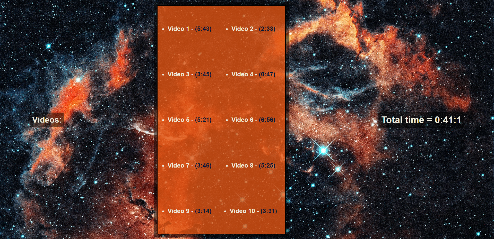

<div align="center">
  
</div>

## Sobre
Neste projeto utilizamos o método `reduce()` para percorrer um array e então somar o tempo de todos os vídeos.

Aqui um pouco da função que utilizamos:
```javascript
// Aqui colocamos os dados em uma constante e percorremos eles com um map()
// então separamos eles com o split() e em seguida arredondamos eles com o
// parseFloat() e multiplicamos os minutos por 60 segundos.
const seconds = timeNodes
  .map(node => node.dataset.time)
  .map(timeCode => {
    const [mins, secs] = timeCode.split(':').map(parseFloat)
    return (mins * 60) + secs
  })
  .reduce((total, vidSeconds) => total + vidSeconds)

let secondsLeft = seconds

// Nesta parte usamos o Math.floor() que arredonda o número para baixo e multiplicamos
// por 3600 segundos, equivalente a uma hora, e 60 segundos, equivalente a um minuto.
const hours = Math.floor(secondsLeft / 3600)
secondsLeft = secondsLeft % 3600

const min = Math.floor(secondsLeft / 60)
secondsLeft = secondsLeft % 60
```

## Imagem
<div align="center">
  
</div>

## Autor


## [Gabriel Bittencourt Penteado](https://www.linkedin.com/in/gabriel-bittencourt-penteado/)

#### Feito com 🤎 por *Gabriel Bittencourt Penteado*. Entre em contato! 👋🏽