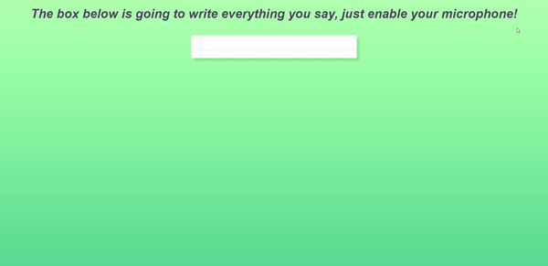

<div align="center">
  
</div>

## Sobre
**ESTÁ FUNÇÃO AINDA ESTA EM DESENVOLVIMENTO, PARA SABER MAIS AQUI TEMOS UM LINK DA [MDN](https://developer.mozilla.org/en-US/docs/Web/API/SpeechRecognition/result_event)**

Nesta aula construimos um identificador de voz no browser que ao habilitar um microfone irá automaticamente escrever em tela o que estamos falando.

Aqui um pouco da função utilizada:
```javascript
// Aqui temos um prototipo do proprio browser que habilitamos para termos acesso ao 
// speech recognition, no caso do Chrome pegamos o webkit
window.SpeechRecognition = window.SpeechRecognition || window.webkitSpeechRecognition

// Aqui fica nossa função que irá executar toda a captação do audio e escrever ela em tela
const recognition = new SpeechRecognition()
recognition.interimResults = true

const words = document.querySelector('.words')
let p = document.createElement('p')

words.appendChild(p)

// Adição do evento 'result' que existe dentro do speech recognition
recognition.addEventListener('result', (e) => {
  const transcript = Array.from(e.results)
    .map((result) => result[0])
    .map((result) => result.transcript)
    .join('')

  p.textContent = transcript
  if (e.results[0].isFinal) {
    p = document.createElement('p')
    words.appendChild(p)
  }
})

// E depois de chamar essa função temos que ouvir pelo evento de 'end' que será quando a pessoa
// parar de falar e chamar novamente a função para continuar escrevendo em outro paragrafo
recognition.addEventListener('end', recognition.start)
```

## Imagem
<div align="center">
  
</div>

## Autor


## [Gabriel Bittencourt Penteado](https://www.linkedin.com/in/gabriel-bittencourt-penteado/)

#### Feito com 🤎 por *Gabriel Bittencourt Penteado*. Entre em contato! 👋🏽