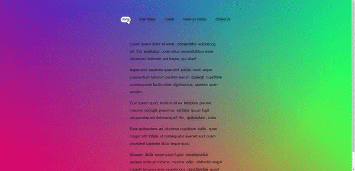

<div align="center">
  
</div>

## Sobre
Neste projeto criamos um highlight de texto que segue o mouse conforme ele passa entre os links que estão dentro da página.

Utilizamos a seguinte função:
```javascript
function highlightText() {
  // Aqui utilizamos o método getBoundingClientRect() que retorna o tamanho do elemento e sua 
  // posição relativa ao viewport, neste caso estamos pegando a tag <a>
  const linkCords = this.getBoundingClientRect()
  // Aqui atribuimos alguns valores para não desencaixar o highlight das tags ancoras e sua posição
  // ficar errada
  const coords = {
    width: linkCords.width,
    height: linkCords.height,
    top: linkCords.top + window.scrollY,
    left: linkCords.left + window.scrollX,
  }

  // E por fim adicionamos o estilo direto no componente via JS pegando as informações do método
  // getBoundingClientRect()
  highlight.style.width = `${coords.width}px`
  highlight.style.height = `${coords.height}px`
  highlight.style.transform = `translate(${coords.left}px, ${coords.top}px)`
}
```

## Imagem
<div align="center">
  
</div>

## Autor


## [Gabriel Bittencourt Penteado](https://www.linkedin.com/in/gabriel-bittencourt-penteado/)

#### Feito com 🤎 por *Gabriel Bittencourt Penteado*. Entre em contato! 👋🏽