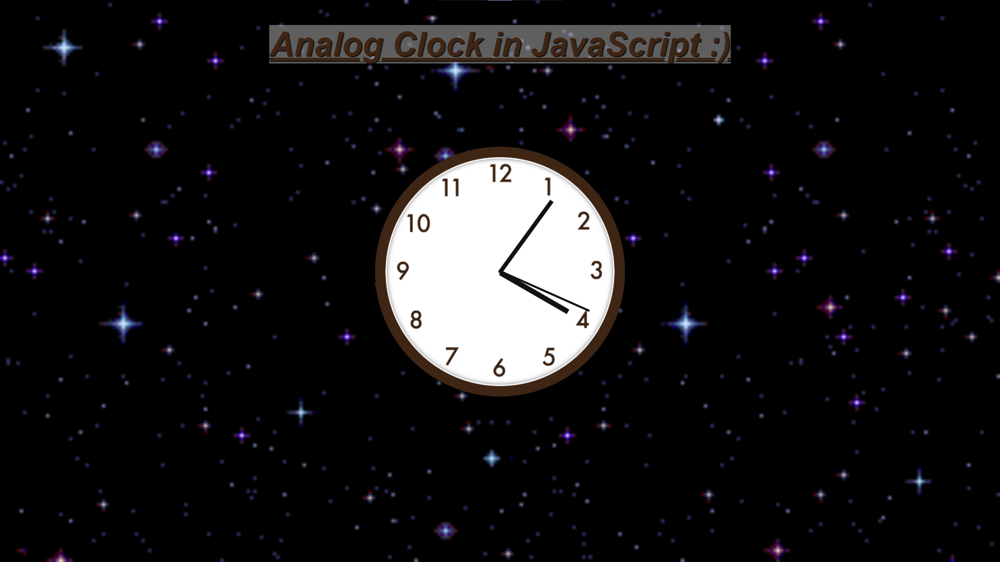

  

## Sobre
Aplicação feita para desenvolver um relógio analógico em **JS** utilizando os graus de rotação como os segundos do relógio e convertendo os valores para terem a lógica de um relógio.

Utilizando função construtora `const now = new Date()`.

## Imagem

## Autor

## [Gabriel Bittencourt Penteado](https://www.linkedin.com/in/gabriel-bittencourt-penteado/)

#### Feito com 🤎 por *Gabriel Bittencourt Penteado*. Entre em contato! 👋🏽