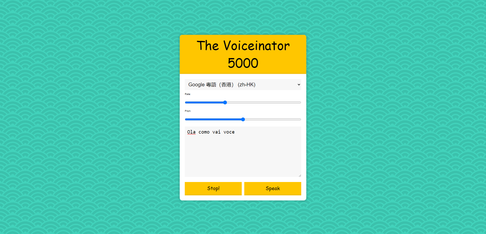

<div align="center">
  
</div>

## Sobre
**ESTÁ FUNÇÃO AINDA ESTA EM DESENVOLVIMENTO, PARA SABER MAIS AQUI TEMOS UM LINK DA [MDN](https://developer.mozilla.org/en-US/docs/Web/API/Window/speechSynthesis)** <br/>
Neste projeto utilizamos o `SpeechSynthesisUtterance()` que seria um leitor de palavras imbutido no Javascript com diversas linguagens do mundo. (No sistema Windows, que é o que eu utilizo, não tive sucesso em obter outras linguages apenas a padrão pt-BR da Microsoft, a zh-CN e zh-HK do Google porém as do Linux funcionam normalmente).

Um pouco do código utilizado nesse projeto:
```javascript
// Função para adicionar as vozes na seleção de opções 
function populateVoices() {
  voices = this.getVoices()

  voicesDropdown.innerHTML = voices
    .map((voice) => `<option value = ${voice.name}>${voice.name} (${voice.lang})</option>`)
    .join('')
}

// Função para controlar os botões de falar e parar
function toggleVoice(startOver = true) {
  speechSynthesis.cancel()
  if (startOver) {
    speechSynthesis.speak(msg)
  }
}
```

## Imagem
<div align="center">
  
</div>

## Autor


## [Gabriel Bittencourt Penteado](https://www.linkedin.com/in/gabriel-bittencourt-penteado/)

#### Feito com 🤎 por *Gabriel Bittencourt Penteado*. Entre em contato! 👋🏽