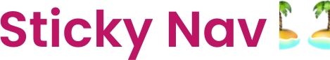
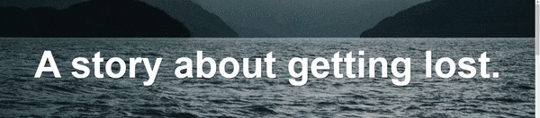

<div align="center">
  
</div>

## Sobre
Nesta aula vimos sobre transformar a posição de um menu de navegação de `relative` para `fixed` com o JS. Observando o `window.scrollY` e o `nav.offsetTop`.

Aqui um pouco do código utilizado:
(Uma observação que foi utilizado o document.body.classList pois podemos utilizar essa classe adicionada no body para mais mudanças de estilo)
```javascript
const nav = document.querySelector('#main')
const topOfNav = nav.offsetTop

// Função para adicionar a classe e transformar a nav bar em fixed quando o valor de scrollY for
// maior ou igual ao offsetTop do nav
function fixNavBar() {
  if (window.scrollY >= topOfNav) {
    document.body.style.paddingTop = nav.offsetHeight + 'px'
    document.body.classList.add('fixed-nav')
  } else {
    document.body.style.paddingTop = 0
    document.body.classList.remove('fixed-nav')
  }
}

window.addEventListener('scroll', fixNavBar)
```

## Imagem
<div align="center">
  
</div>

## Autor


## [Gabriel Bittencourt Penteado](https://www.linkedin.com/in/gabriel-bittencourt-penteado/)

#### Feito com 🤎 por *Gabriel Bittencourt Penteado*. Entre em contato! 👋🏽