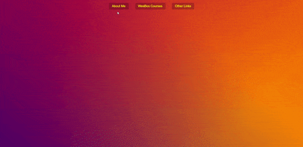

<div align="center">
  
</div>

## Sobre
Neste projeto pegamos a ideia de uma barra de navegação que segue o cursor e deixa um background fixo atrás das opções dentro da opção na navegação, feita por um site.

Aqui temos um pouco do código feito:
```javascript
// As duas principais funções são essas que vão cuidar do evento ao passar o mouse em cima e tirar

// Aqui adicionamos uma classe especifica e usamos o setTimeout() para ativar outra logo em seguida
// para ter um efeito de transição
function handleEnter() {
  this.classList.add('trigger-enter')
  setTimeout(() => {
    if (this.classList.contains('trigger-enter')) {
      this.classList.add('trigger-enter-active')
    }
  }, 150)
  background.classList.add('open')

  // Aqui pegamos as coordenadas do menu e da barra de navegação para o background utilizar essas
  // coordenadas e poder acomodar todos os itens dentro do seu height, width e distancia do topo e
  // da esquerda
  const dropdown = this.querySelector('.dropdown')
  const dropdownCoords = dropdown.getBoundingClientRect()
  const navCoords = nav.getBoundingClientRect()

  const coords = {
    height: dropdownCoords.height,
    width: dropdownCoords.width,
    top: dropdownCoords.top - navCoords.top,
    left: dropdownCoords.left - navCoords.left,
  }

  background.style.setProperty('width', `${coords.width}px`)
  background.style.setProperty('height', `${coords.height}px`)
  background.style.setProperty('transform', `translate(${coords.left}px, ${coords.top}px)`)
}

// Aqui apenas removemos essas classes assim que o mouse sair da barra de navegação
function handleLeave() {
  this.classList.remove('trigger-enter', 'trigger-enter-active')
  background.classList.remove('open')
}
```

## Imagem
<div align="center">
  
</div>

## Autor


## [Gabriel Bittencourt Penteado](https://www.linkedin.com/in/gabriel-bittencourt-penteado/)

#### Feito com 🤎 por *Gabriel Bittencourt Penteado*. Entre em contato! 👋🏽