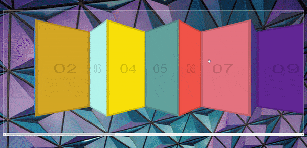

<div align="center">
  
</div>

## Sobre
Neste projeto temos um sistema de clicar e arrastar para mostrar os seguintes banners da página, existem várias bibliotecas que já habilitam isso para nós mas é interessante saber como elas funcionam.

Aqui temos um pouco do código do projeto:
```javascript
// Adicionamos vários eventos com o mouse para poder especificar diversos comportamentos que podem
// acontecer na aplicação
slider.addEventListener('mousedown', (e) => {
  isDown = true
  slider.classList.add('active')
  startX = e.pageX - slider.offsetLeft
  scrollLeft = slider.scrollLeft
})
slider.addEventListener('mouseleave', () => {
  isDown = false
  slider.classList.remove('active')
})
slider.addEventListener('mouseup', () => {
  isDown = false
  slider.classList.remove('active')
})
slider.addEventListener('mousemove', (e) => {
  e.preventDefault()
  if (!isDown) return
  const x = e.pageX - slider.offsetLeft
  const slide = x - startX
  slider.scrollLeft = scrollLeft - slide
})

```

## Imagem
<div align="center">
  
</div>

## Autor


## [Gabriel Bittencourt Penteado](https://www.linkedin.com/in/gabriel-bittencourt-penteado/)

#### Feito com 🤎 por *Gabriel Bittencourt Penteado*. Entre em contato! 👋🏽