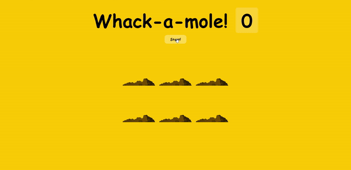

<div align="center">
  
</div>

## Sobre
Neste projeto criamos um simples jogo de acertar a topeira, como projeto final desses 30 dias de javascript.

Aqui um pouco do código utilizado:
```javascript
// Essa primeira função vai servir como tempo para a topeira aparecer e desaparecer dentro do 
// tempo indicado, sendo ele randomico
function peep() {
  const time = randomTime(200, 1200)
  const hole = randomHole(holes)
  hole.classList.add('up')

  setTimeout(() => {
    hole.classList.remove('up')
    if (!timeUp) {
      peep()
    }
  }, time)
}
```

## Imagem
<div align="center">
  
</div>

## Autor


## [Gabriel Bittencourt Penteado](https://www.linkedin.com/in/gabriel-bittencourt-penteado/)

#### Feito com 🤎 por *Gabriel Bittencourt Penteado*. Entre em contato! 👋🏽