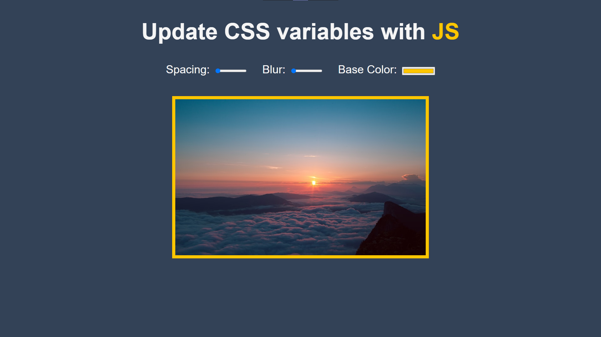

  

## Sobre
Aqui desenvolvemos um metódo para modificar as variáveis do *CSS* no *Javascript*, pelo valor de seus inputs.

Utilizando um simples `.forEach()` e adicionando dentro dele um `.addEventListener()` para o input e assim alterando seu valor por meio de uma função.

## Imagem

## Autor

## [Gabriel Bittencourt Penteado](https://www.linkedin.com/in/gabriel-bittencourt-penteado/)

#### Feito com 🤎 por *Gabriel Bittencourt Penteado*. Entre em contato! 👋🏽