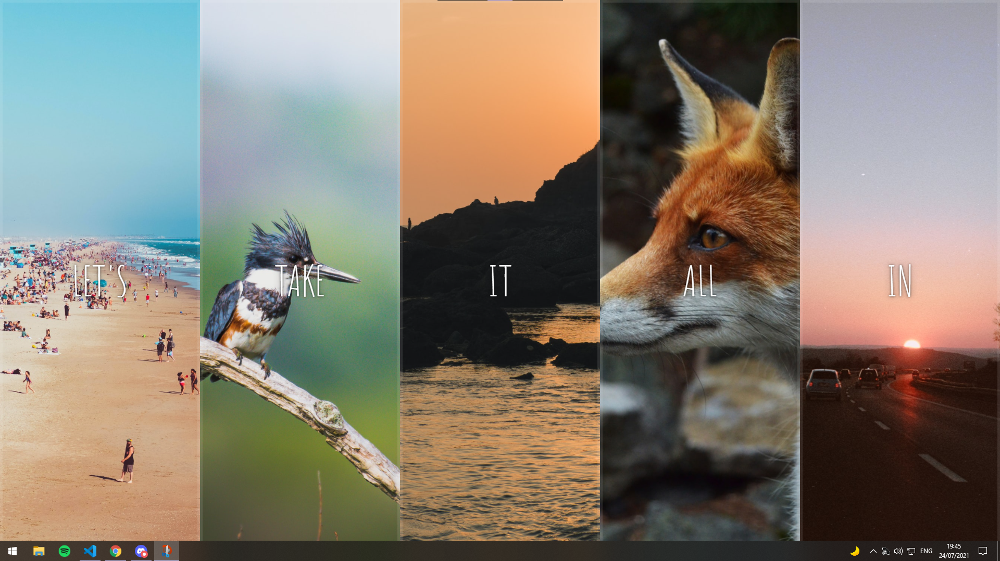

  

## Sobre
Neste desafio criamos um painel de imagens com transições utilizando `flex-box` e `classList.toggle()`.

Uma boa prática para a utilização e entendimento do `display: flex;` e seus comandos, juntamente com um pouco de lógica do JS usando `addEventListener()` para termos esses efeitos junto com o CSS.

## Imagem

## Autor

## [Gabriel Bittencourt Penteado](https://www.linkedin.com/in/gabriel-bittencourt-penteado/)

#### Feito com 🤎 por *Gabriel Bittencourt Penteado*. Entre em contato! 👋🏽