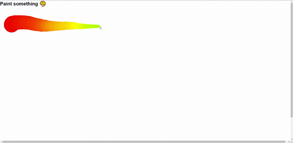

  

## Sobre
Neste desafio criamos uma tela de pintura, canvas, utilizando o Javascript. Um projeto muito interessante e criativo para utilizar o JS.

Aqui usamos a propriedade `window` para capturar a largura e altura do monitor do usuário, também temos vários `addEventListener()` para registrar o movimento do mouse, se o mesmo está clicado ou não e se ele esta fora da janela ou não. Assim conseguindo fazer os seus desenhos na tela.

## Imagem

## Autor

## [Gabriel Bittencourt Penteado](https://www.linkedin.com/in/gabriel-bittencourt-penteado/)

#### Feito com 🤎 por *Gabriel Bittencourt Penteado*. Entre em contato! 👋🏽